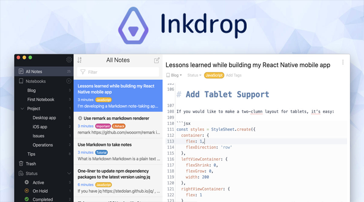

# Darkhaa's Homepage

A modern, visually appealing portfolio website for Darkhanbayar Erdenebat, a Full-Stack Developer and DevOps Engineer based in Mongolia 🇲🇳. This site showcases professional works, collaborations, digital products, and personal achievements.

---

## 🚀 Features

- **Showcase of Projects:** Detailed pages for apps, collaborations, and old works, including:
  - [Cloud.mn](pages/works/cloudmn.js): Mongolia's first public cloud platform, serving 3000+ companies
- **Digital Products:** Coding wallpaper packs ([cherry blossoms](pages/wallpapers/cherry-blossoms.js), [machiya](pages/wallpapers/machiya.js))
- **Responsive Design:** Mobile-friendly and accessible
- **Dark/Light Mode:** Custom Chakra UI theming
- **Animated UI:** Smooth transitions with Framer Motion
- **Blog/Posts:** (Coming soon)

---

## 🛠️ Tech Stack

- [Next.js](https://nextjs.org/) (v13)
- [React](https://react.dev/)
- [Chakra UI](https://chakra-ui.com/) (custom theme)
- [Framer Motion](https://www.framer.com/motion/)
- [Emotion](https://emotion.sh/docs/introduction)
- [Three.js](https://threejs.org/) (for 3D/voxel dog)
- [Vercel Analytics & Speed Insights](https://vercel.com/analytics)
- [Docker](https://www.docker.com/) + [Nginx](https://nginx.org/)

---

## 📦 Folder Structure

```
portfolio/
  components/      # Reusable UI components
  lib/             # Theme and model logic
  pages/           # Next.js pages (routes)
    works/         # Project detail pages
    wallpapers/    # Digital product pages
  public/
    images/        # Profile, project, and wallpaper images
  ...
```

---

## 🖥️ Screenshots

> _Add your own screenshots below!_

| Home Page                                | Works Page                                         | Project Detail                                      |
| ---------------------------------------- | -------------------------------------------------- | --------------------------------------------------- |
|  |  |  |

---

## 📄 License

This project is licensed under the MIT License.

---

## 🖥 Author & Contact

**Darkhanbayar Erdenebat**  
Cloud Engineer (Architect / Developer / DevOps)  
Based in Ulaanbaatar, Mongolia

- [LinkedIn](https://www.linkedin.com/in/darkhanbayar-erdenebat/)
- [Instagram](https://www.instagram.com/chimegbolorr/)
- [GitHub](https://github.com/darkhaa)

&copy; {year} Darkhanbayar Erdenebat. All Rights Reserved.
